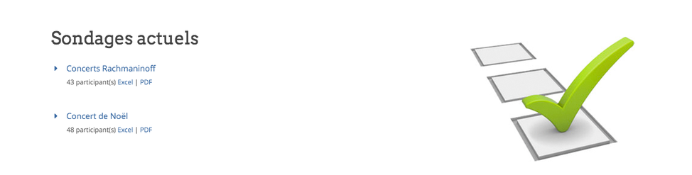

.. _start:

================
Doodle for TYPO3
================

This extension integrates polls created on Doodle (http://doodle.com) within a TYPO3 website.

The underlying API lets you fetch available polls including their metadata, their participants and corresponding
answers/preferences.

The extension is currently in alpha stage and serves as an example of what can be done. Please get in touch on
https://github.com/xperseguers/t3ext-doodle/issues or even prepare pull requests for enhancements and real life
use case implementation.

Purpose of this extension
=========================

Being in need of easily embedding a basic list of polls (title + link) into a TYPO3 website, after creating those two
links manually with a "text" content element, I thought it would be much cooler to get them automatically. I looked for
an API, found none except a basic one to create polls and did not find any existing PHP client either.

I contacted them and got this answer on September 25th, 2015:

    Unfortunately, Doodle won't be offering an API any longer.

    -- Katharina

Although weird, the bottom line is that Doodle is great at preparing and managing polls for friends and colleagues but
totally lacks a proper (REST) API to interact with the platform, even when using a premium account.

As such I wrote first a TYPO3-agnostic `PHP client <https://github.com/xperseguers/doodle_client>`__ and embbeded it
then into a basic TYPO3 extension skeleton to get this project.

Restrictions
============

Please be aware of Doodle's `Terms of Service <http://doodle.com/en_GB/terms-of-service>`__. Particularly, by using this
extension, you understand that you are *potentially* not fully complying with those terms of service (or maybe even not
at all) and that this extension should most probably only be used by authenticated users on your website; so that you do
not duplicate Doodle's features "publicly".

Installation
============

1. Fetch the extension
----------------------

Either install as usual from TER or manually by cloning the Git project:

::

    $ cd /path/to/website/typo3conf/ext/
    $ git clone https://github.com/xperseguers/t3ext-doodle.git doodle
    $ cd doodle/Classes/
    $ composer install

2. Configure the extension
--------------------------

- Open Extension Manager
- Activate the "doodle" extension
- Configure it by either clicking on the title or on the "gear" action icon
- Provide your doodle.com credentials (username / password)

3. Include static template
--------------------------

Just proceed as usual with module :menuselection:`Web --> Templates`. This lets you override the default templates with
your own.

4. Use the plugin(s)
--------------------

Insert Doodle plugin(s) as any other content elements and enjoy!
